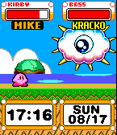
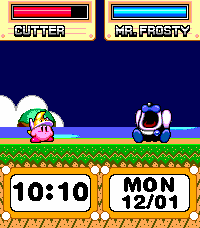

# Kirby Watchface

A watch design featuring Kirby!

It's designed to work on all color-screened Pebbles, as well as the upcoming Core Time 2.

  

Kirby has several different abilities, and a different one is chosen every hour (or whenever you launch the watchface). When you tap the bottom of the watch / flick your wrist the backlight turns on, the current temperature is shown, and Kirby animates.

The boss represents the current weather, and its health represents how close you are to your step goal for the day. When you reach your step goal, the boss is defeated!

Kirby's health represents your remaining battery, and charging status. While on the charger, the health bar is green.

The watchface can also be configured to animate Kirby when the watch is turned to face the wearer.

This project was based on a [project by Game Time](https://github.com/WinterWinter/KirbyGT/), and expanded with new features and animations. Glancing code was based on a [project by pebble-hacks](https://github.com/pebble-hacks/pebble_glancing_demo), with some modifications to functionality to tweak behavior.
